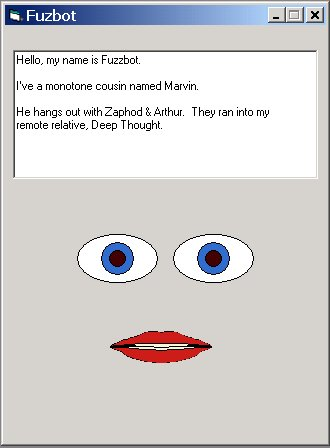



## A talking Bot \- Fuzbot

### Description

A talking program. Enter any text and the bot will (attempt) to speak your text. Now, the voice isn't exactly the greatest, but my kids love it!

Enter the text and then click on his mouth (or the form) and listen to your bot talk!
 
### More Info
 
Requires vtext.dll & vtext.oca (included on my machine with windows 2000 pro in c:\winnt\speech

http://activex.microsoft.com/activex/controls/sapi/spchapi.exe

             |
---                |---
**Submitted On**   |2002-02-09 20:45:58
**By**             |[G Choquette](https://github.com/Planet-Source-Code/PSCIndex/blob/master/ByAuthor/g-choquette.md)
**Level**          |Beginner
**User Rating**    |4.2 (42 globes from 10 users)
**Compatibility**  |VB 6\.0
**Category**       |[Complete Applications](https://github.com/Planet-Source-Code/PSCIndex/blob/master/ByCategory/complete-applications__1-27.md)
**World**          |[Visual Basic](https://github.com/Planet-Source-Code/PSCIndex/blob/master/ByWorld/visual-basic.md)
**Archive File**   |[A\_talking\_54295292002\.zip](https://github.com/Planet-Source-Code/g-choquette-a-talking-bot-fuzbot__1-31649/archive/master.zip)

